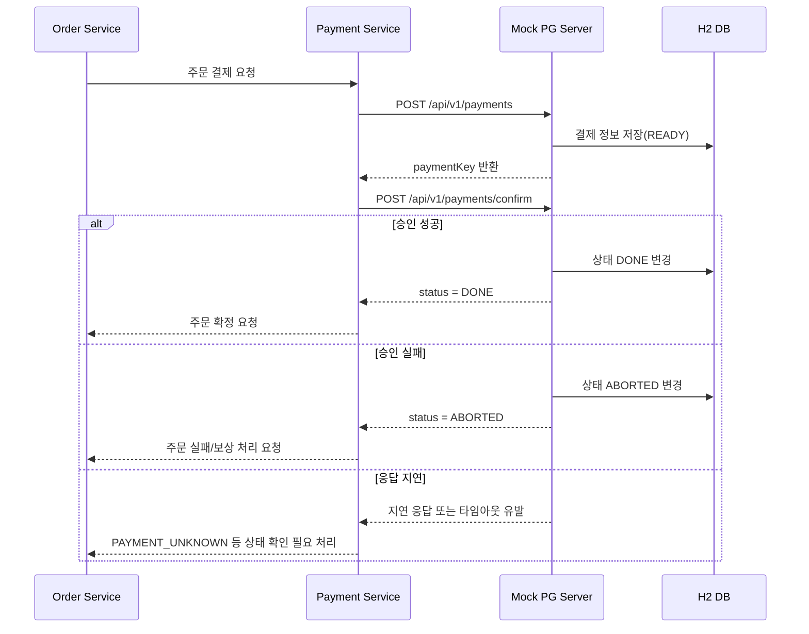
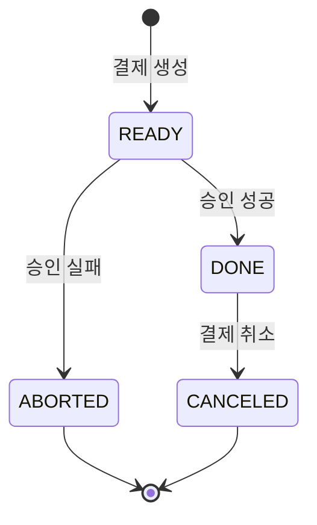
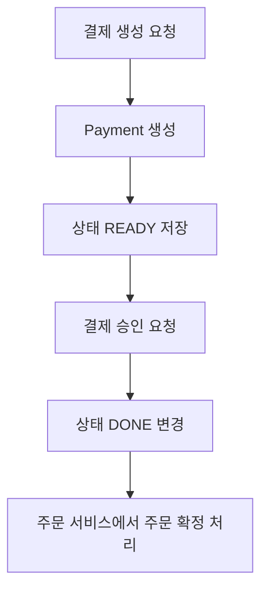
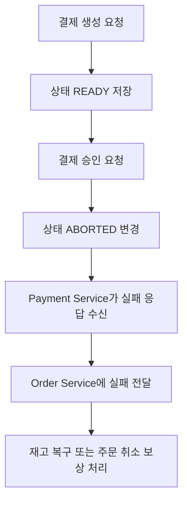
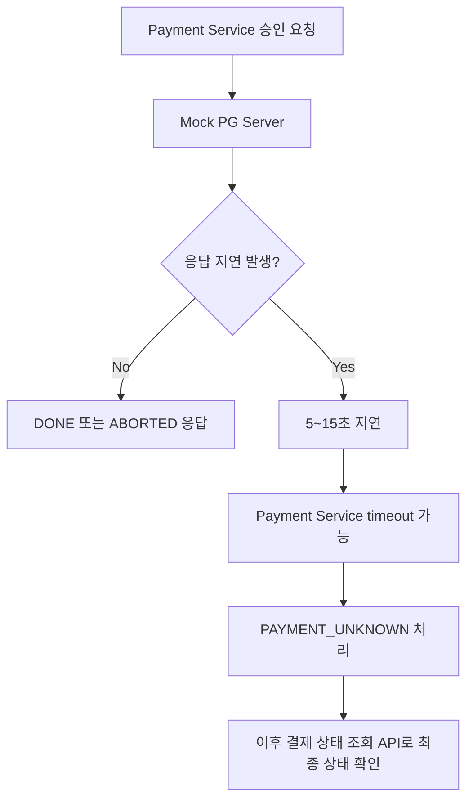
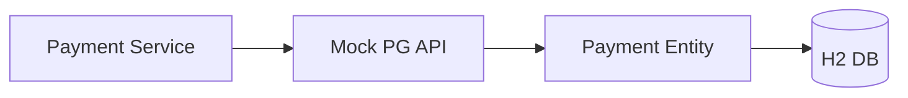
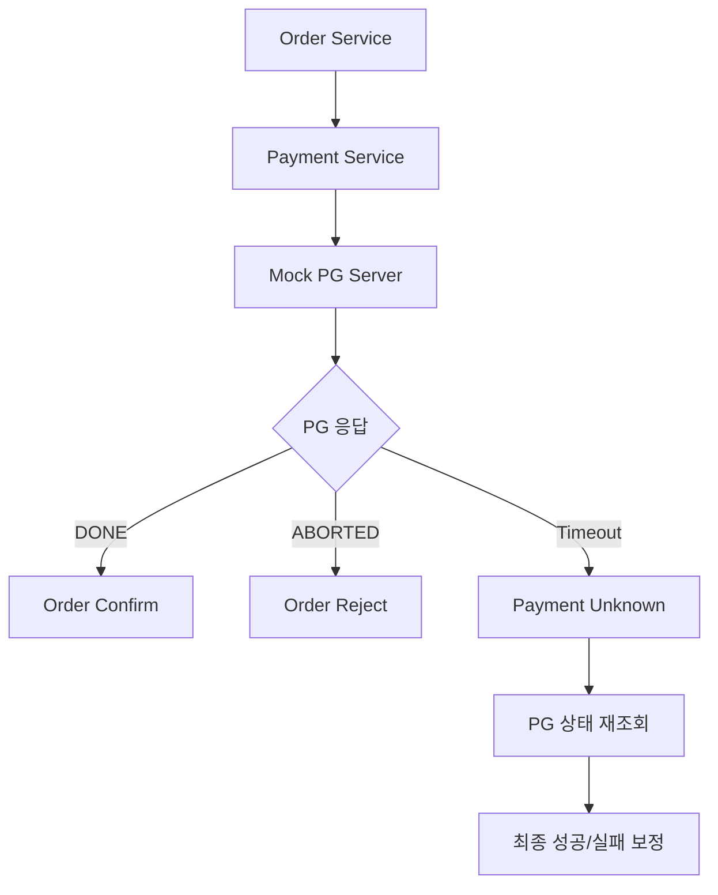
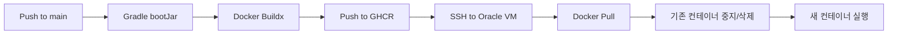

# PG Server

> MSA 결제 흐름 테스트를 위한 **Mock PG(Payment Gateway) 서버**입니다.  
> 실제 결제 승인사를 연동하지 않고도 주문 서비스, 결제 서비스, 보상 트랜잭션, 상태 불명확 처리, 타임아웃 대응 흐름을 검증하기 위해 만든 테스트용 PG 서버입니다.

<br>

## 1. 프로젝트 개요

`pg-server`는 MSA 환경에서 결제 승인 API를 호출하는 상황을 모의하기 위한 Spring Boot 기반 서버입니다.

주문/결제 시스템을 개발할 때 실제 PG사 API를 매번 호출하기 어렵고, 실패/지연/취소 같은 예외 상황을 의도적으로 만들기도 쉽지 않습니다. 이 프로젝트는 다음과 같은 상황을 테스트하기 위해 사용됩니다.

- 결제 요청 생성
- 결제 승인 성공
- 결제 승인 실패
- 결제 상태 조회
- 결제 취소
- 외부 PG 응답 지연 또는 타임아웃 상황
- 주문 서비스와 결제 서비스 간 정합성 검증
- 보상 트랜잭션 테스트

<br>

## 2. 주요 기능

| 기능 | 설명 |
|---|---|
| 결제 생성 | 주문 번호와 금액을 받아 결제 키를 생성합니다. |
| 결제 승인 | 결제 키를 기준으로 결제를 승인합니다. |
| 승인 실패 시뮬레이션 | 일정 확률로 결제 상태를 `ABORTED`로 변경합니다. |
| 응답 지연 시뮬레이션 | 일정 확률로 승인 응답을 지연시켜 네트워크 지연/타임아웃 상황을 테스트합니다. |
| 결제 조회 | 결제 키로 현재 결제 상태를 조회합니다. |
| 결제 취소 | 결제 키로 결제 상태를 `CANCELED`로 변경합니다. |
| Docker 배포 | Dockerfile 및 GitHub Actions 기반 배포 구성을 포함합니다. |

<br>

## 3. 기술 스택

| 구분 | 기술 |
|---|---|
| Language | Java 17 |
| Framework | Spring Boot |
| Web | Spring Web MVC |
| ORM | Spring Data JPA |
| Database | H2 In-Memory DB |
| Build Tool | Gradle Kotlin DSL |
| Container | Docker |
| CI/CD | GitHub Actions, GHCR, Oracle VM |

<br>

## 4. 시스템 흐름



<br>

## 5. 결제 상태 모델



| 상태 | 의미 |
|---|---|
| `READY` | 결제 생성 완료, 승인 전 상태 |
| `DONE` | 결제 승인 완료 |
| `CANCELED` | 결제 취소 완료 |
| `ABORTED` | 결제 승인 실패 |

<br>

## 6. API 명세

### 6.1 결제 생성

```http
POST /api/v1/payments
Content-Type: application/json
```

#### Request

```json
{
  "orderId": "2026-05-03T06:14:57.342620400-dd823-bfb95",
  "totalAmount": 100000
}
```

#### Response

```json
{
  "paymentKey": "7f9a2c3d1e4b5a6c",
  "amount": 100000,
  "orderId": "2026-05-03T06:14:57.342620400-dd823-bfb95"
}
```

<br>

### 6.2 결제 승인

```http
POST /api/v1/payments/confirm
Content-Type: application/json
```

#### Request

```json
{
  "paymentKey": "7f9a2c3d1e4b5a6c",
  "amount": 100000,
  "orderId": "2026-05-03T06:14:57.342620400-dd823-bfb95"
}
```

#### Response - 승인 성공

```json
{
  "paymentKey": "7f9a2c3d1e4b5a6c",
  "orderId": "2026-05-03T06:14:57.342620400-dd823-bfb95",
  "method": "CARD",
  "approvedAt": "2026-05-18T13:00:00.000000+09:00",
  "totalAmount": 100000,
  "status": "DONE",
  "card": null,
  "receipt": null
}
```

#### Response - 승인 실패

```json
{
  "paymentKey": "7f9a2c3d1e4b5a6c",
  "orderId": "2026-05-03T06:14:57.342620400-dd823-bfb95",
  "method": "CARD",
  "approvedAt": null,
  "totalAmount": 100000,
  "status": "ABORTED",
  "card": null,
  "receipt": null
}
```

<br>

### 6.3 결제 조회

```http
GET /api/v1/payments/{paymentKey}
```

#### Example

```bash
curl -X GET http://localhost:8090/api/v1/payments/7f9a2c3d1e4b5a6c
```

<br>

### 6.4 결제 취소

```http
POST /api/v1/payments/{paymentKey}/cancel
```

#### Example

```bash
curl -X POST http://localhost:8090/api/v1/payments/7f9a2c3d1e4b5a6c/cancel
```

#### Response

```json
{
  "paymentKey": "7f9a2c3d1e4b5a6c",
  "orderId": "2026-05-03T06:14:57.342620400-dd823-bfb95",
  "method": "CARD",
  "approvedAt": "2026-05-18T13:00:00.000000+09:00",
  "totalAmount": 100000,
  "status": "CANCELED",
  "card": null,
  "receipt": null
}
```

<br>

## 7. 로컬 실행 방법

### 7.1 저장소 클론

```bash
git clone https://github.com/swjoon/pg-server.git
cd pg-server
```

### 7.2 애플리케이션 실행

```bash
./gradlew bootRun
```

Windows 환경에서는 다음 명령어를 사용할 수 있습니다.

```bash
gradlew.bat bootRun
```

서버는 기본적으로 `8090` 포트에서 실행됩니다.

```text
http://localhost:8090
```

<br>

## 8. Docker 실행

### 8.1 Jar 빌드

```bash
./gradlew clean bootJar -x test
```

빌드 결과물은 다음 경로에 생성됩니다.

```text
build/libs/pg-server.jar
```

### 8.2 Docker 이미지 빌드

```bash
docker build -t pg-server .
```

### 8.3 Docker 컨테이너 실행

```bash
docker run -d \
  --name pg-server \
  -p 8090:8090 \
  -e TZ=Asia/Seoul \
  pg-server
```

<br>

## 9. H2 Console

`application.yml`에서 H2 Console이 활성화되어 있습니다.

```text
http://localhost:8090/h2-console
```

접속 정보는 다음과 같습니다.

| 항목 | 값 |
|---|---|
| JDBC URL | `jdbc:h2:mem:pgserver` |
| Username | `sa` |
| Password | 빈 값 |

<br>

## 10. 테스트 시나리오

### 10.1 정상 결제 승인 흐름



1. `/api/v1/payments`로 결제 정보를 생성합니다.
2. 응답으로 받은 `paymentKey`를 저장합니다.
3. `/api/v1/payments/confirm`으로 승인 요청을 보냅니다.
4. 응답 상태가 `DONE`이면 결제 성공으로 처리합니다.
5. 주문 서비스는 주문 상태를 확정합니다.

<br>

### 10.2 결제 승인 실패 흐름



승인 요청 시 내부 확률 로직에 따라 결제가 실패할 수 있습니다. 이 경우 PG 서버는 결제 상태를 `ABORTED`로 변경하고, 결제 서비스는 이를 기준으로 주문 실패 또는 재고 복구 이벤트를 발행할 수 있습니다.

<br>

### 10.3 응답 지연/타임아웃 흐름



승인 API는 일정 확률로 응답을 지연시킵니다. 이를 통해 실제 외부 PG 연동에서 발생할 수 있는 네트워크 지연, Read Timeout, 상태 불명확 문제를 테스트할 수 있습니다.

<br>

## 11. 프로젝트 구조

```text
pg-server
├── .github
│   └── workflows
│       └── cd.yml
├── src
│   └── main
│       ├── java/app/backend/pgserver
│       │   ├── domain
│       │   │   ├── controller
│       │   │   │   └── PGController.java
│       │   │   ├── dto
│       │   │   │   ├── request
│       │   │   │   └── response
│       │   │   ├── entity
│       │   │   │   ├── Payment.java
│       │   │   │   ├── Method.java
│       │   │   │   └── Status.java
│       │   │   ├── repository
│       │   │   │   ├── PGJpaRepository.java
│       │   │   │   ├── PGRepository.java
│       │   │   │   └── PGRepositoryImpl.java
│       │   │   └── service
│       │   │       ├── PGService.java
│       │   │       └── PGServiceImpl.java
│       │   ├── global
│       │   │   └── util
│       │   └── PgServerApplication.java
│       └── resources
│           └── application.yml
├── Dockerfile
├── build.gradle.kts
└── README.md
```

<br>

## 12. 핵심 구현 포인트

### 12.1 외부 PG 서버 모의

실제 PG사를 연동하지 않고, 내부 DB에 결제 상태를 저장하면서 외부 결제 승인 API처럼 동작하도록 구성했습니다.



<br>

### 12.2 결제 실패 확률 처리

결제 승인 요청 시 내부적으로 성공/실패를 확률 기반으로 분기합니다.

```text
90% 확률: DONE
10% 확률: ABORTED
```

이를 통해 항상 성공하는 단순 Mock이 아니라, 결제 실패와 보상 트랜잭션까지 테스트할 수 있습니다.

<br>

### 12.3 응답 지연 시뮬레이션

승인 API는 일정 확률로 5초에서 15초 사이의 지연을 발생시킵니다.

```text
5% 확률: 5~15초 랜덤 지연
```

이를 통해 다음 상황을 검증할 수 있습니다.

- Feign/RestClient Read Timeout
- 결제 승인 요청 후 응답이 오지 않는 상황
- `PAYMENT_UNKNOWN` 같은 상태 불명확 처리
- 이후 PG 상태 조회를 통한 최종 정합성 복구

<br>

### 12.4 주문/결제 정합성 테스트에 활용

이 서버는 단독 서비스라기보다 주문/결제 MSA에서 다음 흐름을 검증하기 위한 보조 서버입니다.



<br>

## 13. CI/CD

이 프로젝트는 GitHub Actions를 통해 `main` 브랜치 push 시 자동 배포되도록 구성할 수 있습니다.

배포 흐름은 다음과 같습니다.



배포 시 필요한 주요 Secret은 다음과 같습니다.

| Secret | 설명 |
|---|---|
| `GHCR_TOKEN` | GitHub Container Registry 로그인 토큰 |
| `ORACLE_URL` | Oracle VM 접속 주소 |
| `ORACLE_USER` | Oracle VM 접속 사용자 |
| `SSH_KEY` | Oracle VM SSH Private Key |

<br>

## 14. 활용 예시

이 서버는 다음 프로젝트와 함께 사용할 수 있습니다.

- 주문 서비스의 결제 승인 요청 테스트
- 결제 서비스의 외부 PG 연동 어댑터 테스트
- 네트워크 지연 시 상태 불명확 처리 테스트
- 결제 실패 시 재고 복구 이벤트 발행 테스트
- Saga/Outbox/CDC/Kafka 기반 보상 트랜잭션 테스트
- JMeter를 이용한 결제 플로우 부하 테스트

<br>

## 15. 주의사항

이 프로젝트는 실제 PG 결제 서버가 아닙니다.

- 실제 카드 승인 기능이 없습니다.
- 실제 PG사의 인증, 서명, 보안 검증이 없습니다.
- 결제 키는 테스트용 UUID 기반 값입니다.
- H2 In-Memory DB를 사용하므로 애플리케이션 재시작 시 데이터가 초기화될 수 있습니다.
- 운영 서비스가 아닌 테스트/학습/시뮬레이션 용도입니다.

<br>

## 16. 향후 개선 방향

- 결제 승인/실패/지연 확률을 설정값으로 분리
- 결제 취소 사유 및 취소 금액 저장
- 주문 번호 기준 조회 API 추가
- 중복 승인 요청에 대한 멱등성 처리
- `paymentKey` 중복 방지를 위한 더 명확한 정책 적용
- 실제 PG 응답 포맷과 유사한 Mock Response 확장
- 실패/지연 시나리오를 테스트 코드로 고정 가능하게 개선
- Docker Compose 기반 로컬 통합 테스트 환경 추가
- Actuator 기반 health check 추가

<br>

## 17. 실행 예시

### 결제 생성

```bash
curl -X POST http://localhost:8090/api/v1/payments \
  -H "Content-Type: application/json" \
  -d '{
    "orderId": "order-20260518-001",
    "totalAmount": 100000
  }'
```

### 결제 승인

```bash
curl -X POST http://localhost:8090/api/v1/payments/confirm \
  -H "Content-Type: application/json" \
  -d '{
    "paymentKey": "응답으로_받은_paymentKey",
    "amount": 100000,
    "orderId": "order-20260518-001"
  }'
```

### 결제 조회

```bash
curl -X GET http://localhost:8090/api/v1/payments/응답으로_받은_paymentKey
```

### 결제 취소

```bash
curl -X POST http://localhost:8090/api/v1/payments/응답으로_받은_paymentKey/cancel
```
